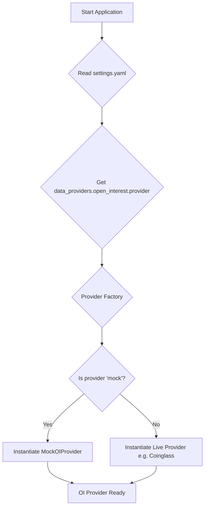

# S4-T2: Open Interest (OI) Provider Interface Design

**Objective:** This document outlines the design for an abstract interface for Open Interest (OI) data providers, ensuring a modular and testable system.

## 1. Abstract Provider Contract

The core of the design is an abstract base class that defines the contract for all OI providers. This contract will be located in `ultra_signals/data/oi_providers/base.py`.

### `fetch_oi_delta` Method

This method is responsible for fetching the change (delta) in Open Interest over specified time windows.

**Signature:**

```python
from abc import ABC, abstractmethod

class AbstractOIProvider(ABC):
    @abstractmethod
    def fetch_oi_delta(self, symbol: str, windows: list[str]) -> dict:
        """
        Fetches the Open Interest delta for a given symbol across multiple time windows.

        Args:
            symbol: The trading symbol (e.g., "BTCUSDT").
            windows: A list of time window strings (e.g., ["1m", "5m", "15m", "1h", "4h", "1d"]).

        Returns:
            A dictionary where keys are the window strings and values are the OI delta values.
            Example:
            {
                "1m": 150000.0,
                "5m": -500000.0,
                "15m": 2000000.0
            }
        """
        pass
```

### Data Structure

The returned dictionary provides a clear and simple way to access the OI delta for each requested window. The values represent the notional or quantity change in open interest. This structure is influenced by the need for multi-timeframe analysis as seen in funding rate calculations (S4-T1).

## 2. Mock Provider Specification

For testing and development, a mock provider will be created that implements the `AbstractOIProvider` contract.

**Location:** `ultra_signals/data/oi_providers/mock.py`

**Behavior:**
The `MockOIProvider` will return a predictable, static dataset for any given call to `fetch_oi_delta`. This allows for consistent testing of components that depend on OI data without making live API calls.

**Example Implementation Output:**

When `fetch_oi_delta(symbol="BTCUSDT", windows=["1m", "5m", "1h"])` is called, the mock provider will return the following static dictionary:

```json
{
    "1m": 100000.0,
    "5m": 500000.0,
    "1h": -2000000.0
}
```

This static response will be hardcoded within the `MockOIProvider` class.

## 3. Configuration-Driven Selection

The active OI provider will be selected via a configuration setting in the `settings.yaml` file. This allows for easily swapping between different providers (e.g., live vs. mock) without changing any code.

**Configuration Key:**

The provider will be specified under the `data_providers` key.

**Example `settings.yaml`:**

```yaml
data_providers:
  open_interest:
    provider: "mock" # Can be "coinglass", "coinalyze", or other future providers
```

The application's logic will read this key at startup to instantiate the correct provider class. A factory function will map the string value `"mock"` to the `MockOIProvider` class.

## 4. Mermaid Diagram: Provider Selection Flow



This design fulfills the requirements for a flexible, configuration-driven OI provider system and includes a clear plan for a mock provider to support robust testing.