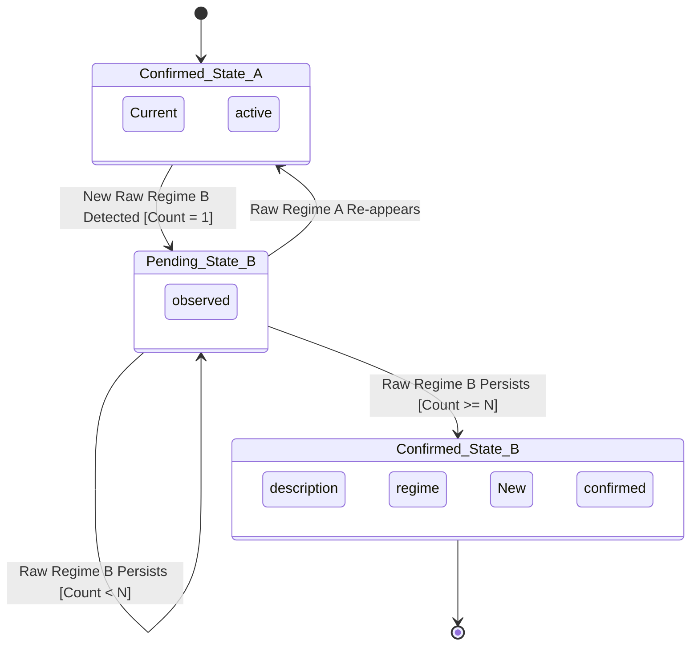

# S4-T4: Regime Classifier Specification

## 1. Overview

This document specifies the design for a market regime classifier. The classifier's purpose is to categorize the market state based on a set of technical indicators, producing a regime output that can be used by downstream trading logic. The output is a structure: `{mode: trend|mean_revert|undefined, vol_bucket: low|med|high|undefined}`.

## 2. State-Mapping Rules

The regime is determined by rules that map input indicator values (ADX, ATR Percentile, Variance Ratio) to a regime output. The following standard thresholds are proposed as a baseline, which can be configured and tuned later.

### 2.1. Volatility Buckets

The `vol_bucket` is determined solely by the ATR Percentile.

| Condition | Output `vol_bucket` |
| :--- | :--- |
| `ATR Percentile` < 30% | `low` |
| 30% <= `ATR Percentile` <= 70% | `med` |
| `ATR Percentile` > 70% | `high` |

### 2.2. Regime Mode

The `mode` is determined by a combination of ADX and the Variance Ratio.

| Condition | Output `mode` | Rationale |
| :--- | :--- | :--- |
| `ADX` > 25 **OR** `Variance Ratio` > 0.7 | `trend` | High ADX or high Variance Ratio suggests strong directional movement. |
| `ADX` < 20 **AND** `Variance Ratio` < 0.3 | `mean_revert` | Low ADX and low Variance Ratio suggests a lack of trend and price oscillation. |
| *Otherwise* | `undefined` | The signals are ambiguous, providing no clear conviction for a specific mode. |

## 3. Hysteresis Logic

To prevent rapid flip-flopping between regimes due to transient indicator noise, a hysteresis mechanism is applied. A regime must be observed for a configurable number of consecutive bars before it is confirmed.

### 3.1. Confirmation Rule

- A `pending_regime` becomes the `current_regime` only after it has been observed for **`N` consecutive bars**.
- **Default `N`**: 3 bars.

### 3.2. Logic Flow

1.  On each new bar, a `raw_regime` is calculated using the state-mapping rules.
2.  **If `raw_regime` matches the active `pending_regime`**: The `confirmation_count` is incremented.
3.  **If `raw_regime` differs from the `pending_regime`**: The `pending_regime` is updated to the `raw_regime`, and the `confirmation_count` is reset to 1.
4.  **If `confirmation_count` >= `N`**: The `current_regime` is updated to match the `pending_regime`, locking it in as the new confirmed state.

### 3.3. State Transition Diagram

The following diagram illustrates the hysteresis logic flow.

## 4. Edge-Case Handling

The following rules define the classifier's behavior in ambiguous or exceptional scenarios.

| Scenario | Rule | Rationale |
| :--- | :--- | :--- |
| **Conflicting Signals** | If indicators fall into the ambiguous zone (e.g., `ADX` between 20-25), the `mode` is `undefined`. The previous `current_regime` is held. | Avoids making decisions on low-conviction signals. |
| **Startup / Insufficient Data** | The classifier outputs `{mode: undefined, vol_bucket: undefined}` until all indicators have sufficient historical data to generate reliable values. | Prevents acting on unstable, initializing indicator values. |
| **Stale Data / Market Halt** | The classifier persists its last known `current_regime`. It does not change state until new data arrives. | The last known state is the most logical assumption in the absence of new price information. A separate system health monitor should handle data feed alerts. |