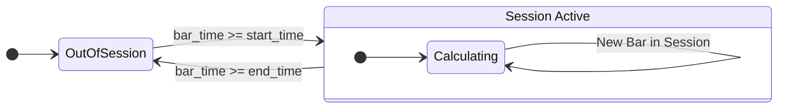

# S5-T2: Session State Model Technical Specification

## 1. Introduction

This document specifies the state model for managing trading sessions. This model is a critical component for the Session VWAP feature, ensuring that VWAP calculations are correctly anchored and reset according to defined session boundaries. It details how session states are determined from configuration, the logic for state transitions, and the precise mechanism for handling concurrent sessions and VWAP resets.

This specification builds upon the definitions laid out in `S5-T1-VWAP-Bands-Spec.md`.

## 2. Session Configuration

Session boundaries are defined entirely by a configuration file. This approach allows for flexible definitions of trading sessions without requiring code changes.

### 2.1. Configuration Structure

Sessions will be defined in a `sessions` list within the application's configuration. Each session is an object containing a unique `name`, a `start_time`, and an `end_time` in `HH:MM:SS` UTC format.

### 2.2. Example Configuration

```yaml
vwap:
  sessions:
    - name: "Asia"
      start_time: "00:00:00"
      end_time: "08:00:00"
    - name: "London"
      start_time: "07:00:00"
      end_time: "16:00:00"
    - name: "New York"
      start_time: "13:00:00"
      end_time: "21:00:00"
```

## 3. State Model and Transition Logic

The system must be capable of tracking the state of multiple sessions concurrently. For each bar, the system will determine which session(s) are currently active. A bar can belong to one, multiple, or no sessions.

### 3.1. Session States

For any given time `T`, the system can be in one or more of the following states simultaneously:

-   `OUT_OF_SESSION`: No defined session is currently active.
-   `IN_SESSION_ASIA`: The current time `T` is within the Asia session boundaries.
-   `IN_SESSION_LONDON`: The current time `T` is within the London session boundaries.
-   `IN_SESSION_NEWYORK`: The current time `T` is within the New York session boundaries.

The state is not a single value but a collection of active sessions. For example, at 14:30 UTC, the system would be in both `IN_SESSION_LONDON` and `IN_SESSION_NEWYORK` states.

### 3.2. State Determination Logic

The state is determined for each incoming bar timestamp (`bar_time`). The logic is as follows:

1.  For each session defined in the configuration:
2.  Check if `session.start_time <= bar_time.time() < session.end_time`.
3.  If true, the session is considered **active** for that bar.

This check is performed independently for every session, allowing for overlaps.

### 3.3. State Transition Diagram (Mermaid)

The following diagram illustrates the lifecycle of a single session. The system manages multiple such lifecycles in parallel, one for each defined session.



**Description:**

-   **OutOfSession**: The default state. The VWAP for this session is not calculated.
-   **InSession**: Triggered when a bar's timestamp is on or after the `start_time`.
-   **Calculating**: While in session, each new bar is added to the session's cumulative VWAP calculation.
-   The session state returns to `OutOfSession` once a bar's timestamp is on or after the `end_time`. The VWAP calculation for that session ceases until the next `start_time`.

## 4. VWAP Reset and Anchor Management

The core of the Session VWAP is its reset mechanism. Each session's VWAP calculation must be managed independently.

### 4.1. VWAP Reset Trigger

-   The Session VWAP calculation for a specific session (e.g., "London") **resets** on the **first tick of the first bar** whose timestamp is greater than or equal to that session's `start_time`.
-   At the moment of reset, the cumulative values for that session's VWAP (`Σ(TP * V)` and `Σ(V)`) are cleared.
-   The bar that triggers the reset becomes the **anchor bar** for that session's VWAP calculation.

### 4.2. Managing Multiple Anchors

Since multiple sessions can be active concurrently, the system must maintain a separate VWAP calculation instance for each defined session.

-   Each `SessionVWAP` instance will have its own state, anchor point, and cumulative calculation variables.
-   When a bar arrives, it is evaluated against all configured sessions.
-   If the bar falls within one or more active sessions, it is passed to the corresponding `SessionVWAP` calculator(s) for processing.

### 4.3. Example Scenario: Overlap and UTC Day Roll

-   **Configuration:** London (07:00-16:00), New York (13:00-21:00).
-   **Bar Time: 13:00:00 UTC, Monday**
    -   The **London** session is already active. This bar is added to the ongoing London VWAP calculation.
    -   This is the first bar of the **New York** session. The New York VWAP calculation is **reset and anchored** to this bar. The system now runs two independent VWAP calculations.
-   **Bar Time: 16:00:00 UTC, Monday**
    -   This is the first bar at or after the London end time. The London VWAP calculation for this session instance concludes. The final VWAP value for the London session is available.
    -   The bar is still within the New York session and is added to its ongoing VWAP calculation.
-   **Bar Time: 23:59:00 UTC, Monday**
    -   All sessions are inactive (`OUT_OF_SESSION`).
-   **Bar Time: 00:00:00 UTC, Tuesday**
    -   This is the first bar of the new **Asia** session. The Asia VWAP calculation is **reset and anchored** to this bar.

## 5. Acceptance Criteria Checklist

-   [x] Document is named `S5-T2-Session-Model-Spec.md`.
-   [x] Specifies configuration for session boundaries.
-   [x] Includes a state diagram illustrating transitions.
-   [x] Details the precise trigger for VWAP reset.
-   [x] Explains management of concurrent session anchors.
-   [x] Provides clear examples of session overlaps and UTC day roll.