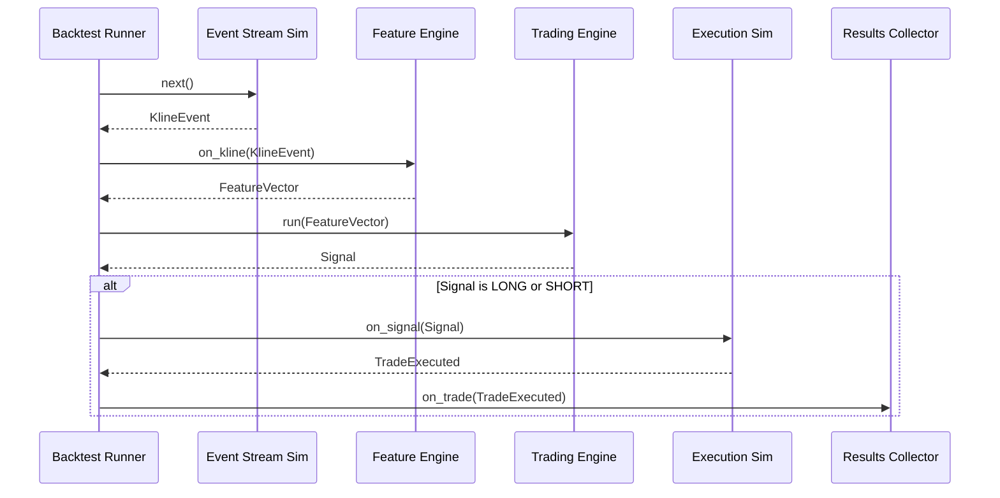
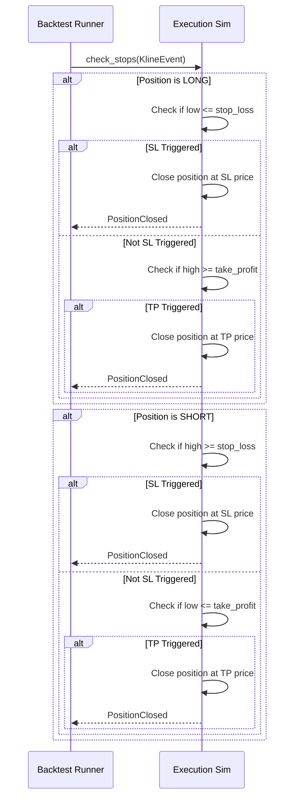

# S6-T1: Event-Driven Backtester - Technical Design

## 1. Overview

This document specifies the technical design for the new event-driven backtester for the `ultra_signals` project. The primary goal is to create a simulation environment that mirrors the live trading engine's logic, allowing for high-fidelity strategy testing, validation, and calibration.

The backtester will process historical market data bar-by-bar, generating events that are consumed by the existing signal generation and risk management components. This approach maximizes code reuse and ensures that strategies behave consistently between backtesting and live trading.

## 2. Core Architecture & Event Flow

The backtesting engine is composed of several key components that work together to simulate the lifecycle of a trading strategy.

### 2.1. System Components

1.  **Backtest Runner**: The top-level orchestrator. It is responsible for initializing all components, loading configuration and data, driving the event loop, and collecting results.
2.  **Data Handler**: Loads historical OHLCV data from a specified source (e.g., CSV files, a database). It prepares the data for the simulator.
3.  **Event Stream Simulator**: The heart of the backtester. It iterates through the historical data, constructs `KlineEvent` objects for each bar, and publishes them. This component mimics the behavior of a live market data feed.
4.  **Feature Engine**: Consumes `KlineEvent`s and calculates all required technical indicators and feature vectors (`FeatureVector`). This is the same feature engine used in the live system.
5.  **Trading Engine**: The existing `ultra_signals/engine` module. It consumes `FeatureVector`s, applies scoring logic (`scoring.py`), generates signals (`entries_exits.py`), and applies risk filters (`risk_filters.py`).
6.  **Portfolio & Execution Simulator**: Manages the state of the simulated trading account (cash, positions, equity). It receives `Signal` objects from the Trading Engine and simulates trade execution, including SL/TP checks, slippage, and commission costs.
7.  **Results Collector**: Subscribes to events from the Portfolio (e.g., `TradeFilled`, `PositionClosed`) and compiles performance metrics (e.g., PnL, Sharpe Ratio, Drawdown).

### 2.2. Event Flow (High-Level)

The system operates on a sequential event loop, processing one bar at a time.

1.  The **Backtest Runner** initializes all components and loads data via the **Data Handler**.
2.  The **Backtest Runner** starts the main loop, asking the **Event Stream Simulator** for the next event.
3.  The **Event Stream Simulator** yields a `KlineEvent` for the current bar.
4.  The **Feature Engine** receives the `KlineEvent` and updates all its indicators.
5.  Once the **warmup period** is complete, the **Feature Engine** generates a `FeatureVector`.
6.  The **Trading Engine** receives the `FeatureVector` and decides whether to generate a `Signal` (LONG, SHORT, or NO_TRADE).
7.  The generated `Signal` is passed to the **Portfolio & Execution Simulator**.
8.  The **Execution Simulator** checks if the new `Signal` should open a position. It also checks if the current bar's High/Low prices would trigger the Stop-Loss or Take-Profit of any *existing* open positions.
9.  If a trade is executed, the **Portfolio** is updated, and a `TradeFilled` event is emitted.
10. The **Results Collector** captures the `TradeFilled` event.
11. The loop continues to the next bar until the data stream is exhausted.
12. Finally, the **Backtest Runner** instructs the **Results Collector** to compute and return the final performance report.


## 3. Event Stream Simulator

The Event Stream Simulator is the component responsible for generating a sequence of market events from historical data. It is designed to be a Python generator, yielding one `KlineEvent` at a time.

### 3.1. Responsibilities

-   To iterate over a provided historical dataset (e.g., a Pandas DataFrame).
-   To construct and yield a `ultra_signals.core.events.KlineEvent` for each row in the dataset.
-   To ensure the yielded event contains all necessary fields (`timestamp`, `symbol`, `timeframe`, `open`, `high`, `low`, `close`, `volume`).
-   To set the `closed` flag on the `KlineEvent` to `True`, as each historical bar represents a completed interval.

### 3.2. Pseudocode Implementation

```python
from typing import Generator
import pandas as pd
from ultra_signals.core.events import KlineEvent

class EventStreamSimulator:
    def __init__(self, historical_data: pd.DataFrame, symbol: str, timeframe: str):
        """
        Initializes the simulator with historical data.
        
        Args:
            historical_data (pd.DataFrame): DataFrame with OHLCV data, indexed by timestamp.
            symbol (str): The symbol for the asset.
            timeframe (str): The timeframe for the data.
        """
        self._data = historical_data
        self._symbol = symbol
        self._timeframe = timeframe
        self._iterator = self._data.itertuples()

    def stream(self) -> Generator[KlineEvent, None, None]:
        """
        A generator that yields KlineEvent objects for each bar in the historical data.
        """
        for row in self._iterator:
            event = KlineEvent(
                timestamp=int(row.Index.timestamp() * 1000), # Convert to ms
                symbol=self._symbol,
                timeframe=self._timeframe,
                open=row.open,
                high=row.high,
                low=row.low,
                close=row.close,
                volume=row.volume,
                closed=True
            )
            yield event
```


## 4. Intra-Bar Execution Logic

To achieve a realistic simulation, the backtester cannot simply wait for the `close` of a bar to act. Stop-Loss (SL) and Take-Profit (TP) orders can be triggered by the `high` or `low` price within the bar. The following logic defines the order of operations for checking these triggers.

### 4.1. Order of Price Movements

Since historical OHLCV data does not tell us whether the High or Low price was hit first within a bar, we must adopt a consistent and conservative assumption.

-   **Assumption:** The worst-case price movement is checked first.
-   **For a LONG position:** We assume the price moved from `open` down to `low` first, and then up to `high` before settling at `close`. This means we check for a Stop-Loss trigger before a Take-Profit trigger.
-   **For a SHORT position:** We assume the price moved from `open` up to `high` first, and then down to `low` before settling at `close`. This means we check for a Stop-Loss trigger before a Take-Profit trigger.

This conservative approach prevents the backtester from claiming a profitable exit on a trade that would have been stopped out first in a real-world scenario.

### 4.2. Logic for an Active Position

On each new `KlineEvent`, before processing any new trading signals, the **Execution Simulator** will perform the following checks for any open position:

1.  **Retrieve the current bar's data**: `open`, `high`, `low`, `close`.
2.  **Retrieve the active position's details**: `direction` (LONG/SHORT), `entry_price`, `stop_loss`, `take_profit_1`, `take_profit_2`.

3.  **For a LONG Position:**
    a. **Check Stop-Loss:** Did the bar's `low` price cross below the `stop_loss` level?
       - `if low <= stop_loss:`
       - The position is closed at the `stop_loss` price.
       - The check is complete for this bar; we assume the trade is stopped out and do not check for TP.

    b. **Check Take-Profit:** If the SL was not triggered, did the bar's `high` price cross above a `take_profit` level?
       - `if high >= take_profit_2:`
       - Close position at `take_profit_2`.
       - `elif high >= take_profit_1:`
       - Close partial/full position at `take_profit_1`.

4.  **For a SHORT Position:**
    a. **Check Stop-Loss:** Did the bar's `high` price cross above the `stop_loss` level?
       - `if high >= stop_loss:`
       - The position is closed at the `stop_loss` price.
       - The check is complete for this bar.

    b. **Check Take-Profit:** If the SL was not triggered, did the bar's `low` price cross below a `take_profit` level?
       - `if low <= take_profit_2:`
       - Close position at `take_profit_2`.
       - `elif low <= take_profit_1:`
       - Close partial/full position at `take_profit_1`.


### 4.3. Handling Simultaneous Triggers

In the rare event that a single bar is volatile enough to trigger both the SL and TP levels (e.g., for a LONG, `low <= stop_loss` and `high >= take_profit_1`), our conservative "stop-loss first" assumption means the trade will always be recorded as a loss. The position is closed at the `stop_loss` price.


## 5. Warmup Period Handling

Trading indicators, such as moving averages or RSI, require a certain amount of historical data to produce meaningful values. The backtester must handle this "warmup" phase correctly to avoid generating signals based on unreliable, partially-calculated indicators.

### 5.1. Mechanism

The backtester will use the same warmup check that already exists in the live engine's risk filters (`risk_filters._check_warmup_period`). This ensures consistency and reuses existing logic.

1.  **Configuration**: The required number of warmup bars will be read from the global settings file, specifically from `settings['features']['warmup_periods']`. This value should be set to the longest period required by any indicator in the strategy (e.g., if the longest EMA is 200 periods, the warmup period must be at least 200).

2.  **Pre-computation Loop**: Before the main trading simulation loop begins, the **Backtest Runner** will feed `warmup_periods` number of `KlineEvent`s from the **Event Stream Simulator** directly into the **Feature Engine**.

3.  **Stateful Feature Engine**: The **Feature Engine** is stateful. During this pre-computation phase, it will compute indicators for each bar but will not generate any `FeatureVector`s intended for trading. It will simply build up its internal state (e.g., the series of past prices needed for an EMA).

4.  **Signal Suppression**: During the warmup phase, the **Backtest Runner** will not request signals from the **Trading Engine**. The loop is exclusively for populating the feature calculators.

5.  **Commencing the Test**: After the warmup data has been processed, the main backtest loop begins. On the very next bar, the **Feature Engine** will be able to produce a valid, fully-formed `FeatureVector`, and the system can begin checking for trading signals.


## 6. Backtester API Contracts

This section defines the primary interfaces for configuring and running the backtester, as well as the data structures for its output.

### 6.1. Inputs

The backtester will be invoked through a primary `run_backtest` function or a `BacktestRunner` class.

#### 6.1.1. Configuration Object

A Pydantic model will be used to define the backtest configuration, ensuring all required parameters are present and validated.

```python
from pydantic import BaseModel, FilePath
from typing import List, Dict
import datetime

class BacktestConfig(BaseModel):
    """
    Configuration for a single backtest run.
    """
    run_id: str
    strategy_name: str
    
    # Data Soure
    symbol: str
    timeframe: str
    data_path: FilePath  # Path to CSV containing OHLCV data
    start_date: datetime.date
    end_date: datetime.date
    
    # Strategy Parameters
    # These will be passed to the scoring/entries_exits modules
    strategy_params: Dict 
    
    # Portfolio & Costs
    initial_capital: float = 100000.0
    commission_bps: float = 2.0  # Commission in basis points (e.g., 2.0 = 0.02%)
    slippage_pct: float = 0.01 # Estimated slippage as a percentage of price
```

#### 6.1.2. Main Entrypoint Function

```python
import pandas as pd

def run_backtest(config: BacktestConfig) -> pd.DataFrame:
    """
    Orchestrates the backtest run.

    Args:
        config: A BacktestConfig object containing all run parameters.

    Returns:
        A pandas DataFrame containing the summary of performance metrics.
    """
    # 1. Load data using config.data_path, filter by date range
    # 2. Initialize all components (Event Simulator, Portfolio, etc.)
    # 3. Run warmup period
    # 4. Run main event loop
    # 5. Compute and return final metrics
    pass
```

### 6.2. Outputs

The backtester will produce two primary outputs: a log of all trades and a final summary of performance metrics.

#### 6.2.1. Trade Log

A list of all executed trades. Each trade will be a structured object or dictionary.

```python
@dataclass
class Trade:
    """
    Represents a single round-trip trade.
    """
    entry_timestamp: int
    exit_timestamp: int
    symbol: str
    direction: Literal["LONG", "SHORT"]
    entry_price: float
    exit_price: float
    size: float
    pnl: float
    pnl_pct: float
    exit_reason: str # e.g., "TP1", "SL", "End of Data"
```

#### 6.2.2. Performance Metrics Summary

The final output of `run_backtest` will be a DataFrame containing key performance indicators (KPIs).

| Metric                | Description                                         |
| --------------------- | --------------------------------------------------- |
| **Net PnL**           | Total profit or loss from the strategy.             |
| **Total Return %**    | Net PnL as a percentage of initial capital.         |
| **Sharpe Ratio**      | Risk-adjusted return (annualized).                  |
| **Max Drawdown %**    | The largest peak-to-trough decline in portfolio value. |
| **Win Rate %**        | Percentage of trades that were profitable.          |
| **Profit Factor**     | Gross profits / Gross losses.                       |
| **Total Trades**      | The total number of trades executed.                |
| **Avg. Trade PnL %**  | The average return per trade.                       |

```


## 7. Sequence Diagrams

### 7.1. Main Event Loop (Per Bar)

This diagram illustrates the flow of information for each bar of historical data once the warmup period is complete.



### 7.2. Intra-Bar SL/TP Check

This diagram shows the logic within the Execution Simulator for checking if an existing position should be closed due to a stop-loss or take-profit trigger. This happens *before* processing a new signal for the current bar.


