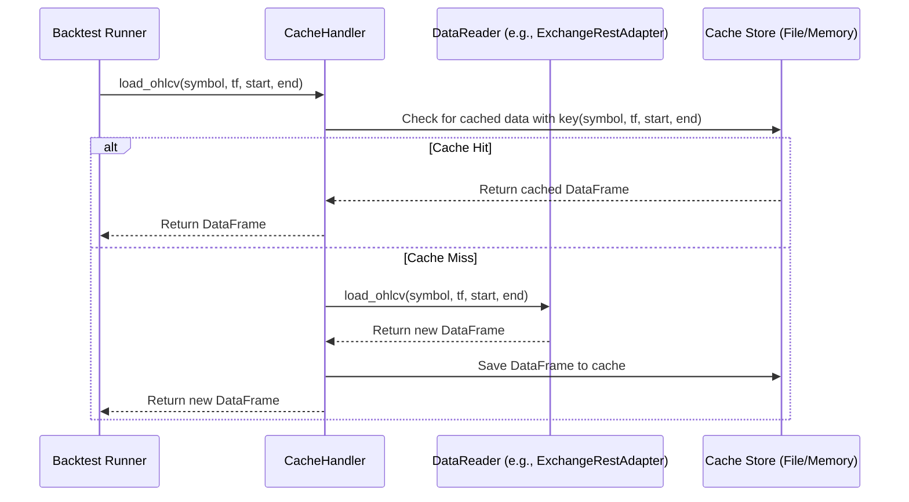

# S6-T2: Data Adapters - Technical Design

## 1. Overview

This document specifies the design for the data adapter architecture for the `ultra_signals` backtesting framework. The goal is to create a flexible system for loading historical data from various sources, including exchange APIs and local files, while incorporating a caching layer to optimize performance.

This design supersedes the `data_path` parameter in the `BacktestConfig` from the `S6-T1` design, replacing it with a more robust and extensible data source management system.

## 2. Core Concepts

### 2.1. Data Adapter
A **Data Adapter** is a component responsible for fetching data from a specific source (e.g., Binance API, a local CSV file). Each adapter will implement a standardized interface, allowing the backtester to consume data without needing to know the underlying source's details.

### 2.2. Data Source Locator (DSL)
A **Data Source Locator (DSL)** is a URI-like string that uniquely identifies a data source and the adapter needed to handle it. This allows the backtester configuration to specify data sources in a clean, readable way.

Examples:
- `binance://klines?symbol=BTCUSDT&tf=1h`
- `file:///path/to/data/btc_1h.csv?format=csv`
- `file:///path/to/data/eth_1d.parquet?format=parquet`

## 3. Unified Data Reader Interface

The backtesting engine will interact with all data adapters through a single, unified interface. This ensures consistency and decouples the core logic from the specifics of data retrieval. The interface will be defined as a Python `Protocol`.

### 3.1. Primary Interface: `DataReader`

This protocol defines the essential methods that every data adapter must implement.

```python
from typing import Protocol, Optional
import pandas as pd
import datetime

class DataReader(Protocol):
    """
    A unified interface for loading historical market data for the backtester.
    
    Adapters implementing this protocol are responsible for fetching data from a 
    specific source (e.g., exchange API, local file, database) and returning it 
    as a standardized pandas DataFrame.
    """

    def load_ohlcv(
        self, 
        symbol: str, 
        tf: str, 
        start: datetime.datetime, 
        end: datetime.datetime
    ) -> pd.DataFrame:
        """
        Loads OHLCV (Open, High, Low, Close, Volume) data.

        Args:
            symbol (str): The trading symbol to load (e.g., 'BTCUSDT').
            tf (str): The timeframe for the data (e.g., '1h', '4h', '1d').
            start (datetime.datetime): The start of the date range (inclusive).
            end (datetime.datetime): The end of the date range (inclusive).

        Returns:
            pd.DataFrame: A DataFrame indexed by a timezone-aware DatetimeIndex 
                          with the following columns, all as float64:
                          ['open', 'high', 'low', 'close', 'volume'].
                          Returns an empty DataFrame if no data is found.
        """
        ...

    def load_trades(
        self, 
        symbol: str, 
        start: datetime.datetime, 
        end: datetime.datetime
    ) -> Optional[pd.DataFrame]:
        """
        Loads individual trade data (tick-level).

        This is an optional method for advanced use cases like calculating
        Cumulative Volume Delta (CVD). If a source does not provide trade data,
        this method should return None.

        Args:
            symbol (str): The trading symbol to load.
            start (datetime.datetime): The start of the date range.
            end (datetime.datetime): The end of the date range.

        Returns:
            Optional[pd.DataFrame]: A DataFrame indexed by a timezone-aware 
                                    DatetimeIndex with the following columns:
                                    ['price' (float64), 'size' (float64), 'side' (str, 'buy' or 'sell')].
                                    Returns None if the data source is not supported.
        """
        ...

```


## 4. Source Adapter Specifications

This section details the concrete implementations of the `DataReader` interface for different data sources.

### 4.1. Exchange REST Adapter (`ExchangeRestAdapter`)

This adapter is responsible for fetching OHLCV data directly from an exchange's public REST API. It is best suited for situations where local data is not available or needs to be updated.

- **DSL Scheme:** `binance://`, `bybit://`, etc.
- **Example DSL:** `binance://klines?symbol=BTCUSDT&amp;tf=1h`

#### 4.1.1. Configuration

The adapter's behavior will be controlled by parameters from three sources:
1.  The DSL string.
2.  Global configuration (`settings.yaml`).
3.  The `load_ohlcv` method arguments.

| Parameter     | Source              | Example                | Description                                                 |
| ------------- | ------------------- | ---------------------- | ----------------------------------------------------------- |
| `exchange`    | DSL Scheme          | `binance`              | The target exchange. Used to select the correct API client. |
| `symbol`      | Method Argument     | `'BTCUSDT'`            | The asset pair to fetch.                                    |
| `tf`          | Method Argument     | `'1h'`                 | The timeframe for the klines.                               |
| `api_key`     | Global Config (`env`) | `env.BINANCE_API_KEY`  | Optional API key for higher rate limits.                    |
| `api_secret`  | Global Config (`env`) | `env.BINANCE_SECRET`   | Optional API secret.                                        |
| `rate_limit`  | Global Config       | `1200`                 | Requests per minute allowed by the exchange.                |
| `retries`     | Global Config       | `3`                    | Number of retry attempts on network failures or API errors. |

#### 4.1.2. Primary Methods

- **`__init__(self, dsl: str, config: AppConfig)`**:
  - Parses the `dsl` to identify the target exchange.
  - Initializes the appropriate underlying API client (e.g., a `ccxt` instance for Binance).
  - Loads rate limiting and retry settings from the application `config`.

- **`load_ohlcv(...)`**:
  - Converts the requested `start` and `end` datetimes into the timestamp format required by the exchange's API.
  - Calculates the required number of API calls based on the date range and the API's per-request data limit (e.g., 1000 bars per call for Binance).
  - Implements a loop to fetch data paginated.
  - **Crucially**, it includes a `time.sleep()` call between requests to respect the exchange's `rate_limit`.
  - Concatenates the results from all pages into a single DataFrame.
  - Standardizes the column names (`['timestamp', 'open', 'high', 'low', 'close', 'volume']`) and sets a `DatetimeIndex`.

#### 4.1.3. Error Handling

- **Network Errors:** The adapter will implement a retry mechanism with exponential backoff for transient network issues or `429 Too Many Requests` errors.
- **API Errors:** If the exchange returns a persistent error (e.g., `400 Bad Request` for an invalid symbol), the adapter will log the error and return an empty DataFrame.
- **No Data:** If the query is valid but returns no data for the requested range, it will return an empty DataFrame.

---

### 4.2. Local File Adapter (`LocalFileAdapter`)

This adapter reads data from local storage, providing fast and consistent data access for repeated backtests. It is the preferred adapter for most use cases.

- **DSL Scheme:** `file://`
- **Example DSL:**
  - `file:///data/crypto/binance/BTCUSDT-1h.csv`
  - `file:///data/crypto/binance/ETHUSDT-1d.parquet?format=parquet`

#### 4.2.1. Configuration

| Parameter   | Source        | Example                   | Description                                                 |
| ----------- | ------------- | ------------------------- | ----------------------------------------------------------- |
| `file_path` | DSL Path      | `/data/crypto/BTCUSDT....`  | Absolute or relative path to the data file.                 |
| `format`    | DSL Query     | `'csv'`, `'parquet'`      | The file format. If not provided, it will be inferred from the file extension. |
| `symbol`    | Method Argument | `'BTCUSDT'`               | The asset pair to load. Used to filter data if the file contains multiple symbols. |
| `tf`        | Method Argument | `'1h'`                    | The timeframe. Used for filtering.                          |

#### 4.2.2. Primary Methods

- **`__init__(self, dsl: str)`**:
  - Parses the `dsl` to extract the `file_path` and `format`.
  - Infers `format` from the file extension if not explicitly provided in the DSL.

- **`load_ohlcv(...)`**:
  - Checks if the `file_path` exists. If not, returns an empty DataFrame.
  - Uses the appropriate Pandas function to read the data (`pd.read_csv` or `pd.read_parquet`).
  - **Important:** After loading, it filters the DataFrame to include only the data within the requested `start` and `end` datetime range.
  - Validates that the DataFrame contains the required OHLCV columns.
  - Sets a timezone-aware `DatetimeIndex`.

#### 4.2.3. Error Handling

- **File Not Found:** If the file at `file_path` does not exist, it will log a warning and return an empty DataFrame.
- **Corrupt File / Format Mismatch:** If Pandas fails to parse the file (e.g., `ParserError` for a malformed CSV), it will log a critical error and return an empty DataFrame.
- **Missing Columns:** If the loaded file is missing required columns (`open`, `high`, `low`, `close`, `volume`), it will log an error and return an empty DataFrame.


---

### 4.3. Synthetic Trades Adapter (Fallback)

In scenarios where true tick-level trade data is not available, this mechanism provides a fallback to estimate trade flow from standard OHLCV bars. This is not a separate adapter but a utility that can be used by the backtesting engine when `load_trades` returns `None`.

#### 4.3.1. Logic

The synthesis logic operates on a single OHLCV bar and generates a small number of trades that simulate the price movement within that bar. A common, simple model is as follows:

1.  **Opening Trade:** A trade occurs at the `open` price.
2.  **Intra-bar Trades:**
    *   One trade occurs at the `high` price.
    *   One trade occurs at the `low` price.
3.  **Closing Trade:** A trade occurs at the `close` price.

The `side` of these synthetic trades can be inferred from the candle's direction:
- If `close > open` (bullish candle), assume trades at `low` and `close` are 'buy' and trades at `open` and `high` are 'sell'.
- If `close < open` (bearish candle), assume trades at `high` and `close` are 'sell' and trades at `open` and `low` are 'buy'.
- Volume is distributed proportionally among the synthetic trades based on the total bar `volume`.

This is a simplified model and should be used with the understanding that it is a rough approximation of true market activity.

## 5. Caching Strategy

To minimize redundant data fetching, especially from remote sources like exchange APIs, a caching layer will be implemented. This layer will sit between the backtest runner and the data adapters.

### 5.1. Cache Handler

A new component, the `CacheHandler`, will wrap a `DataReader` instance. When data is requested, the `CacheHandler` first checks the cache. If a valid cache entry is found, it's returned immediately. If not, the request is passed through to the underlying adapter, and the result is stored in the cache before being returned.



### 5.2. Cache Key

The cache key must uniquely identify a dataset. It will be a string composed of the core data parameters:
`key = f"{symbol}_{tf}_{start.isoformat()}_{end.isoformat()}"`

### 5.3. Cache Storage

A file-based caching strategy using the **Parquet** format is recommended for its efficiency and compression.

- **Cache Directory:** A dedicated directory will be configured in `settings.yaml`, e.g., `.cache/`.
- **File Naming:** Cache files will be named using a url-safe hash of the cache key to avoid issues with special characters in symbols or timeframes.
  - `filename = hashlib.sha256(key.encode()).hexdigest() + ".parquet"`
- **Cache Invalidation:** The current design does not include time-based invalidation. The cache is considered persistent. To refresh the data for a specific period, the user must manually clear the relevant cache files.


## 6. Integration with Backtester

This new data adapter architecture will directly integrate into the `BacktestRunner` specified in `S6-T1`.

### 6.1. Updated `BacktestConfig`

The `BacktestConfig` Pydantic model will be updated. The `data_path: FilePath` field will be replaced with a `data_source_locator: str` field.

```python
from pydantic import BaseModel, constr
import datetime

# Previous fields from S6-T1...

class BacktestConfig(BaseModel):
    """
    Configuration for a single backtest run.
    """
    run_id: str
    strategy_name: str
    
    # The new way to specify the data source
    data_source_locator: constr(strip_whitespace=True, min_length=1)
    
    symbol: str
    timeframe: str
    start_date: datetime.date
    end_date: datetime.date
    
    # ... other parameters remain the same
```

### 6.2. Backtest Runner Logic Update

The `run_backtest` orchestrator will be modified as follows:

1.  **Initialization**:
    - It will parse the `data_source_locator` from the config.
    - It will instantiate a `DataReaderFactory` which is responsible for creating the correct adapter based on the DSL scheme (`file://`, `binance://`).
    - The factory will return the appropriate adapter (`LocalFileAdapter`, `ExchangeRestAdapter`).
    - This adapter will then be wrapped by the `CacheHandler`.

2.  **Data Loading**:
    - Instead of reading a single CSV, the runner will now call:
      `data = cache_handler.load_ohlcv(symbol, tf, start, end)`

This updated workflow provides a clean separation of concerns, where the backtester's core logic is completely isolated from the details of data sourcing and caching.
