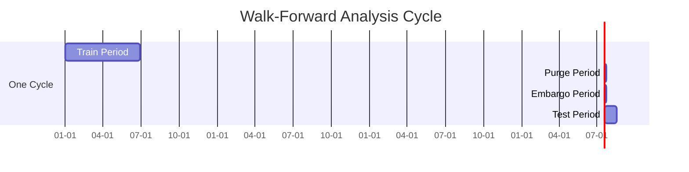

# S6-T6: Walk-Forward Evaluation Plan

## 1. Overview

This document specifies the methodology for walk-forward analysis, a robust method for backtesting trading strategies that helps mitigate the risk of overfitting. The framework is designed to test strategies on out-of-sample data in a rolling fashion, incorporating purging and embargo periods to prevent data leakage between training and testing sets.

## 2. Walk-Forward Methodology

### 2.1. Rolling Windows

The walk-forward analysis is structured around a series of rolling time windows. Each window consists of a training period and a testing period.

-   **`train_period`**: The duration of the data used to train the model (e.g., "6m" for 6 months).
-   **`test_period`**: The duration of the out-of-sample data used to evaluate the model (e.g., "1m" for 1 month).

The windows roll forward sequentially. After each cycle, the window advances by the `test_period`.

### 2.2. Purging and Embargo

To ensure the integrity of the out-of-sample tests, we will implement purging and embargo periods.

-   **`purge_period`**: A period of data removed from the *end* of the training set. This is crucial for preventing look-ahead bias, where features might inadvertently use information from the future (e.g., a 14-day moving average calculated on day `T` uses data from `T-13` to `T`). If the test period starts immediately at `T+1`, the training and test sets are not truly independent.
-   **`embargo_period`**: A period of data removed from the *start* of the test set. This is used to reduce the impact of serial correlation between the training and testing sets. The model trained on data up to time `T` might have residual influence on market behavior at `T+1`.

## 3. Timeline Diagram

The following diagram illustrates a single walk-forward cycle:



*(Note: Durations are illustrative)*

**Description:**
1.  **Train Period**: The model is trained on historical data.
2.  **Purge Period**: Data at the end of the training set is discarded.
3.  **Embargo Period**: A gap is created between the training and testing data.
4.  **Test Period**: The trained model is evaluated on unseen, out-of-sample data.

## 4. Configuration File Format

The walk-forward analysis will be controlled by a YAML configuration file. This allows for easy parameterization and reproducibility.

**Structure:**

```yaml
# Walk-Forward Analysis Configuration

walk_forward_config:
  # Defines the overall start and end dates for the entire analysis
  analysis_start_date: "2022-01-01"
  analysis_end_date: "2024-01-01"

  # Rolling window parameters
  window:
    train_period: "6m" # 6 months
    test_period:  "1m" # 1 month
    advance_by:   "1m" # How much to slide the window forward each iteration

  # Data cleansing parameters
  data_rules:
    purge_period: "5d" # 5 days
    embargo_period: "5d" # 5 days

# List of symbols to include in this backtest run
symbols:
  - "BTC-PERP"
  - "ETH-PERP"
  - "SOL-PERP"

# Versioning for reproducibility
version_info:
  strategy_version: "v1.2.3"
  config_version: "1.0"
  data_commit_hash: "a1b2c3d4" # Git hash of the data version used
```

## 5. Reproducibility

To ensure that every walk-forward run is fully reproducible, the following elements must be version-controlled:

1.  **Code**: All strategy code, feature definitions, and backtesting logic must be versioned in Git. The exact commit hash used for a run should be logged.
2.  **Configuration**: The YAML configuration file for each run must be stored and versioned.
3.  **Data**: The underlying market data should be immutable. A data snapshot or a specific data version (e.g., identified by a commit hash if stored in a versioned repository) must be associated with each run.

The results of each walk-forward run should be stored with a unique identifier, linking back to the specific code, configuration, and data versions used.