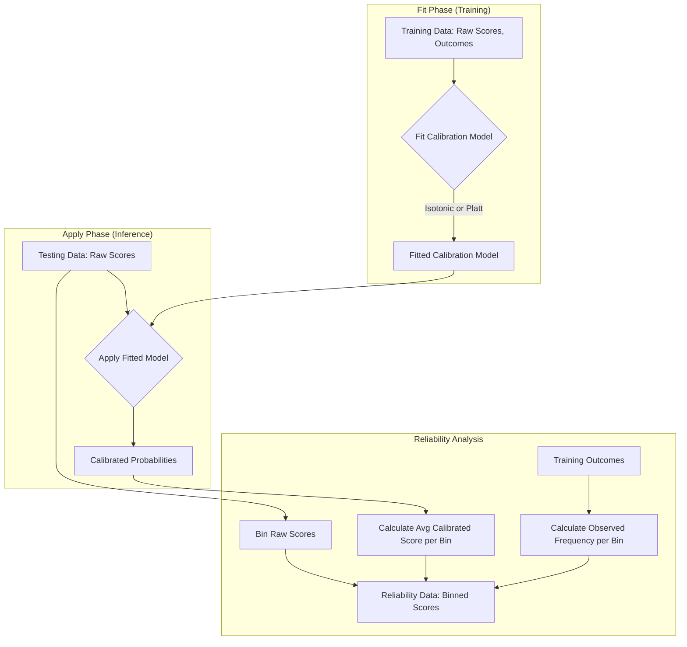

# S6-T8: Confidence Calibration Specification

**Author**: Roo
**Date**: 2025-08-22
**Status**: Draft

## 1. Overview

This document specifies the design for a confidence calibration module. The purpose of this module is to convert raw model confidence scores into true probabilities that accurately reflect the observed frequency of successful outcomes. This calibration is essential for reliable position sizing, risk management, and overall model evaluation.

The system will support two primary calibration methods, provide a clear data flow for training and application, and generate data for creating reliability diagrams to assess calibration quality.

## 2. Calibration Models

The system will provide the following calibration models.

### 2.1. Isotonic Regression (Default)

-   **Description**: A non-parametric method that fits a free-form, non-decreasing function to the data. It is powerful and makes no assumptions about the shape of the calibration curve, making it ideal for a wide range of models.
-   **Usage**: This will be the default calibration method due to its flexibility and effectiveness.

### 2.2. Platt Scaling (Optional)

-   **Description**: A parametric method that fits a logistic regression model to the scores. It assumes the calibration curve is sigmoidal.
-   **Usage**: This will be an optional alternative method. It can be more robust when the training dataset is small or noisy, as it imposes a stronger assumption on the calibration curve's shape.

## 3. Data Flow

The calibration process is divided into a "fit" phase (training) and an "apply" phase (testing/inference).

### 3.1. Process Steps

1.  **Input (Training Data)**: The process begins with a dataset containing:
    *   `raw_scores`: A series of floating-point confidence scores produced by the model (e.g., values between 0.0 and 1.0).
    *   `outcomes`: A corresponding series of binary outcomes (1 for success/win, 0 for failure/loss).

2.  **Fit**: A calibration model is fitted using the training data.
    *   The chosen model (`Isotonic Regression` or `Platt Scaling`) learns the mapping between the `raw_scores` and the `outcomes`.
    *   The result of this step is a `fitted_calibration_model`.

3.  **Apply**: The `fitted_calibration_model` is used to transform new, uncalibrated scores.
    *   **Input (Testing Data)**: A new set of `raw_scores` from a testing or live trading dataset.
    *   **Output**: A set of `calibrated_probabilities` that should better represent the true likelihood of success.

### 3.2. Data Flow Diagram

## 4. Reliability Diagrams

To visually assess the quality of the calibration, the system must produce the data necessary for generating reliability diagrams.

### 4.1. Binning Process

-   The raw confidence scores from a dataset will be partitioned into a fixed number of bins (e.g., 10 bins of equal width: [0.0, 0.1], [0.1, 0.2], ..., [0.9, 1.0]).

### 4.2. Required Data Output

For each bin, the system must calculate and output the following three values:

1.  **Average Raw Score**: The mean of the raw model scores within the bin. This is the x-axis of the reliability diagram.
2.  **Average Calibrated Score**: The mean of the calibrated probabilities for the scores within the bin. This shows the model's calibrated prediction.
3.  **Observed Frequency**: The actual proportion of successful outcomes (1s) for all events in the bin. This is the y-axis and represents the "true" probability.

A perfectly calibrated model would have the average calibrated score equal to the observed frequency in every bin.

## 5. Per-Regime Calibration (Optional Extension)

To account for changing market dynamics, the system can be extended to support calibration on a per-regime basis.

-   **Mechanism**:
    1.  **Tagged Data**: Input data (scores and outcomes) would need to be tagged with a market "regime" identifier (e.g., `High Volatility`, `Low Volatility`, `Trending`).
    2.  **Segregated Fitting**: During the "Fit" phase, a separate calibration model would be trained for each regime's subset of the data.
    3.  **Dynamic Application**: During the "Apply" phase, the system would first identify the current market regime and then select the corresponding fitted model to apply to the raw scores.

This allows the calibration to adapt to different market conditions where the relationship between confidence scores and outcomes may vary significantly.