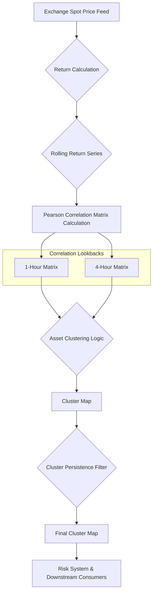

# S7-T3: Correlation Engine Specification

**Owner:** Portfolio Management Team
**Status:** Final
**Date:** 2025-08-22

## 1. Overview

This document specifies the design of the Correlation Engine, a core component of the portfolio risk management system. The engine's primary function is to identify and group highly correlated assets, enabling the system to monitor and control concentrated risk exposures. By understanding how assets move together, we can avoid over-concentration in assets that are statistically similar.

The specification covers the design of the correlation matrix, the asset clustering methodology, system behavior, and a data flow diagram.

## 2. Data Flow Diagram

The following diagram illustrates the operational flow of the Correlation Engine, from data ingestion to cluster publication.

## 3. Correlation Matrix Design

The foundation of the engine is a rolling **return correlation matrix**.

- **Correlation Method:** Pearson correlation coefficient (ρ).
- **Input Data:** Log returns of asset spot prices, sourced from the primary exchange feed. Log returns are used to ensure time-additivity.
- **Calculation:** For a set of *N* assets, the engine will compute an *N x N* matrix where each element `(i, j)` contains the correlation coefficient `ρ(i, j)` between the return series of asset *i* and asset *j*.

### 3.1. Lookback Periods

To capture both short-term and medium-term dynamics, two separate correlation matrices will be maintained:

1.  **Short-Term Matrix:**
    *   **Lookback Period:** 1 hour
    *   **Purpose:** Captures intraday correlations and reacts quickly to changing market conditions. Useful for high-frequency risk management.

2.  **Medium-Term Matrix:**
    *   **Lookback Period:** 4 hours
    *   **Purpose:** Provides a more stable, smoothed view of asset relationships, filtering out short-term noise. Useful for daily risk assessment.

## 4. Clustering Logic

Assets will be grouped into clusters based on their correlation values. The goal is to create groups of assets that are statistically interchangeable from a risk perspective.

- **Methodology:** Simple Thresholding. Two assets, *i* and *j*, are considered part of the same cluster if their **absolute correlation** meets a minimum threshold.
- **Clustering Algorithm:** A single-linkage approach will be used. If Asset A is highly correlated with Asset B, and Asset B is highly correlated with Asset C, then A, B, and C will all belong to the same cluster, even if A and C are not directly correlated above the threshold.
- **Correlation Threshold:** `abs(ρ) >= 0.7`. This value is configurable and can be tuned based on backtesting and empirical analysis.

## 5. System Behavior

The engine's operational behavior is defined by its refresh cadence and a persistence mechanism to ensure cluster stability.

### 5.1. Refresh Cadence

- **Correlation Matrix:** The 1-hour and 4-hour correlation matrices will be recalculated every **5 minutes**.
- **Cluster Map:** The cluster map will be regenerated immediately following each correlation matrix update, also every **5 minutes**.

### 5.2. Persistence and Hysteresis

To prevent "cluster churn"—where assets rapidly jump between clusters due to minor fluctuations in correlation—a persistence mechanism will be implemented.

- **Mechanism:** A **Time-in-State Filter**.
- **Rule:** An asset's cluster assignment can only change if the new proposed cluster assignment remains valid for **3 consecutive calculation periods** (i.e., 15 minutes).
- **Logic:**
    1.  When the clustering algorithm proposes a new cluster assignment for an asset, a "pending change" state is initiated with a 3-period counter.
    2.  If the same change is proposed in the next calculation, the counter is decremented.
    3.  If a different change is proposed or the original assignment becomes valid again, the counter is reset.
    4.  The cluster assignment is only finalized and published downstream after the counter reaches zero.

This mechanism ensures that only persistent shifts in correlation structure result in a re-clustering of assets, reducing operational noise.

## 6. Example: Clustering BTC, ETH, and SOL

This example demonstrates how the engine would cluster three highly correlated crypto assets.

**Assumptions:**
- **Assets:** BTC, ETH, SOL
- **Lookback Period:** 1-Hour Correlation Matrix
- **Correlation Threshold:** `abs(ρ) >= 0.7`

**Step 1: Calculate the Correlation Matrix**

The engine calculates the following 1-hour correlation matrix:

| Asset | BTC   | ETH   | SOL   |
| :---- | :---- | :---- | :---- |
| **BTC** | 1.00  | 0.85  | 0.75  |
| **ETH** | 0.85  | 1.00  | 0.90  |
| **SOL** | 0.75  | 0.90  | 1.00  |

**Step 2: Apply Clustering Logic**

The clustering algorithm processes the matrix:
- `ρ(BTC, ETH)` is 0.85, which is `>= 0.7`. BTC and ETH are linked.
- `ρ(ETH, SOL)` is 0.90, which is `>= 0.7`. ETH and SOL are linked.
- `ρ(BTC, SOL)` is 0.75, which is `>= 0.7`. BTC and SOL are linked.

**Step 3: Form the Cluster**

Due to the single-linkage logic, all three assets are grouped into a single cluster.
- **Cluster 1:** `[BTC, ETH, SOL]`

This cluster map is then passed to the persistence filter before being published. If this grouping remains consistent for 3 consecutive periods, the risk system will be notified that BTC, ETH, and SOL should be treated as a single risk bloc.