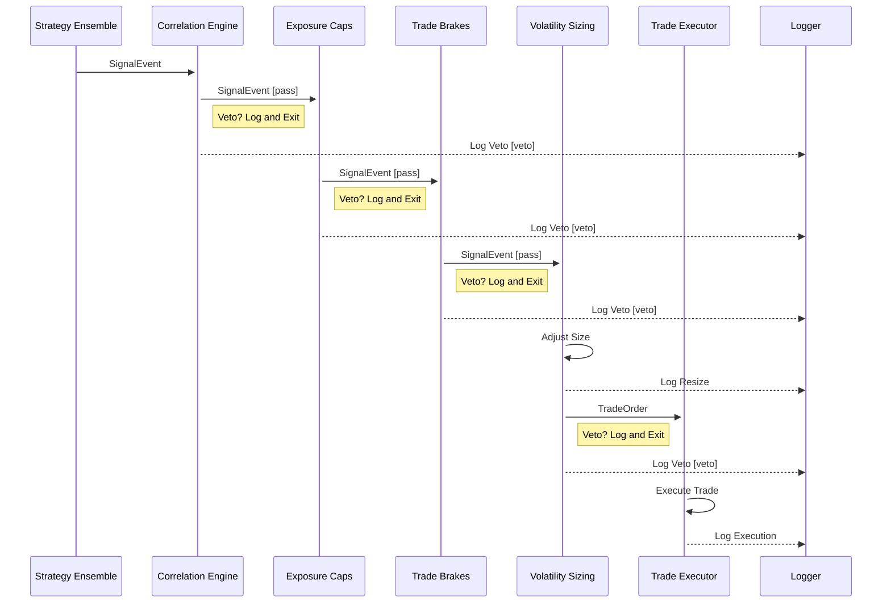

# S7-T7: Engine Integration Plan

## 1. Overview

This document outlines the master plan for integrating the individual trading engine components into a cohesive system. It defines the execution flow, from signal generation by the strategy ensemble to final trade vetting by portfolio-level risk controls.

## 2. Execution Flow

The system operates in a sequential, gated process. A trade signal must pass through a series of filters before it can be executed. If any filter vetoes the trade, the process halts, and the veto reason is logged.

The sequence of operations is as follows:

1.  **Strategy Ensemble Signal Generation**: A new `SignalEvent` is generated by the ensemble of strategies. This is the initial proposed trade.
2.  **Correlation Filter**: The `CorrelationEngine` checks if the proposed trade would increase portfolio correlation above a defined threshold.
3.  **Exposure Caps**: The `ExposureManager` verifies that the trade does not breach per-asset or total portfolio exposure limits.
4.  **Trade Brakes**: The `TradeBrake` module checks for rapid, successive trades in the same direction for the same asset.
5.  **Volatility Sizing**: The `VolatilitySizer` adjusts the trade size based on current market volatility. A `null` or `zero` size is a soft veto.
6.  **Final Trade**: If the signal passes all gates, a final `TradeOrder` is created and sent for execution.

## 3. Logging Requirements

Logging is critical for transparency and debugging. The following events must be logged:

*   **Signal Generation**: Log the initial signal from the strategy ensemble.
    *   `Event: ENSEMBLE_SIGNAL_GENERATED`
    *   `Payload: {signal}`
*   **Filter Veto**: When any risk filter vetoes a trade, the reason must be logged.
    *   `Event: TRADE_VETOED`
    *   `Payload: {signal, filter_name, reason}`
*   **Trade Resized**: If the volatility sizer adjusts the trade size.
    *   `Event: TRADE_RESIZED`
    *   `Payload: {signal, original_size, new_size}`
*   **Trade Execution**: The final trade order sent for execution.
    *   `Event: TRADE_EXECUTED`
    *   `Payload: {trade_order}`

## 4. Sequence Diagram

The following Mermaid diagram illustrates the end-to-end execution flow.

