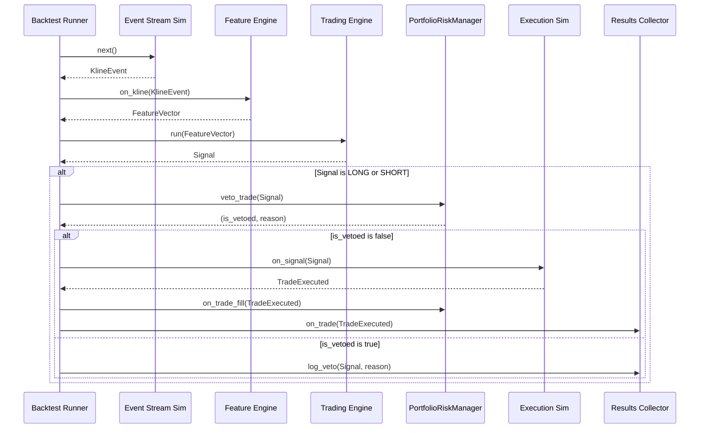

# S7-T8: Backtest/Walk-Forward Integration Specification

**Author:** Roo, Technical Leader
**Date:** 2025-08-22
**Status:** Final

## 1. Overview

This document specifies the necessary modifications to the existing event-driven backtester and walk-forward analysis framework to support the new portfolio-level risk management rules introduced in Sprint 7. The goal is to ensure high-fidelity simulation of these rules, enabling accurate analysis of their impact on strategy performance.

This specification covers three areas:
1.  **Simulation Logic:** How the new rules are checked on a bar-by-bar basis.
2.  **API Hooks:** The necessary changes to the backtester's event loop to integrate the new risk checks.
3.  **Reporting Fields:** New data points to be added to backtest reports for analyzing rule performance.

---

## 2. Simulation Logic

To accurately simulate the live engine's behavior, the backtester's event loop will be modified to incorporate the new portfolio rules. These checks will occur *after* a trading signal is generated but *before* a trade is executed, mirroring the sequence defined in `S7-T7-Engine-Integration-Plan.md`.

The simulation must be stateful, tracking portfolio exposure and trade history dynamically throughout the test period.

### 2.1. State Management

The backtester's `Portfolio` or a new `PortfolioStateManager` component will be responsible for maintaining the following state variables, which are updated on every bar:

*   **Current Positions:** A dictionary of all open positions.
*   **Portfolio Equity:** The total value of the portfolio, updated with the close of each bar.
*   **Gross Exposure:** Sum of the absolute notional value of all positions.
*   **Net Exposure:** Sum of the notional value of long positions minus the notional value of short positions.
*   **Cluster Exposures:** A dictionary mapping each asset cluster to its current long and short notional exposure.
*   **Trade History:** A timestamped record of recent trades to enforce spacing rules.
*   **Daily P&L:** The portfolio's profit or loss for the current simulated day (UTC).
*   **Consecutive Losses:** Counters for symbol-specific and global losing streaks.

### 2.2. Bar-by-Bar Evaluation Sequence

For each `KlineEvent` processed by the `Backtest Runner`:

1.  **SL/TP Check:** First, the system checks if the current bar's `high` or `low` would trigger a Stop-Loss or Take-Profit for any existing open positions, as per the logic in `S6-T1-Backtester-Design.md`. If a position is closed, the portfolio state (equity, exposure) is updated immediately.

2.  **Signal Generation:** The `Trading Engine` processes the `FeatureVector` for the current bar and generates a potential `Signal` (LONG, SHORT, or NO_TRADE).

3.  **Pre-Trade Vetting Gauntlet:** If a `Signal` is generated, it is passed through a sequence of checks representing the new portfolio rules. The checks are executed in the order specified in `S7-T5`'s truth table to ensure hard stops are evaluated before softer rules.

    *   **a. Check Performance Brakes (Hard Stop):**
        *   **Rule:** `Daily Net P&L <= -4%`?
        *   **Action:** If true, the `Signal` is **vetoed**. Log the veto reason.

    *   **b. Check Global Losing Streak:**
        *   **Rule:** `5 consecutive global losses`?
        *   **Action:** If true, check if the 4-hour cooldown is active. If so, the `Signal` is **vetoed**. Log the veto reason.

    *   **c. Check Symbol Losing Streak:**
        *   **Rule:** `3 consecutive losses on the signal's symbol`?
        *   **Action:** If true, check if the 1-hour cooldown is active for that symbol. If so, the `Signal` is **vetoed**. Log the veto reason.

    *   **d. Check Trade Spacing:**
        *   **Rule:** Was another trade opened in the same asset cluster within the last 3 minutes?
        *   **Action:** If true, the `Signal` is **vetoed**. Log the veto reason.

    *   **e. Pre-compute Post-Trade Exposure:**
        *   Calculate the hypothetical portfolio exposure *if* the trade were to be executed. This includes updating `Net/Gross Portfolio Exposure` and the relevant `Cluster Notional Exposure`.

    *   **f. Check Exposure Caps (`S7-T4`):**
        *   **Rule 1:** Does the proposed trade breach the `Per-Symbol Risk` (e.g., sized > 1% of equity)?
        *   **Rule 2:** Does it breach the `Cluster Notional` cap (long or short)?
        *   **Rule 3:** Does it breach the `Net Portfolio Exposure` cap?
        *   **Rule 4:** Does it breach the `Gross Portfolio Exposure` cap?
        *   **Action:** If any cap is breached, the `Signal` is **vetoed**. The system may support logic to scale down the trade to fit, but the primary implementation will be a simple veto. Log the veto reason and which limit was breached.

4.  **Trade Execution:** If the `Signal` passes all checks, the `Execution Simulator` proceeds to open the position at the bar's `close` price, applying slippage and commission costs. The portfolio state is updated accordingly.

---

## 3. API Hooks and Component Modifications

To implement the simulation logic, modifications are required to the existing backtester components described in `S6-T1-Backtester-Design.md`. This section outlines the necessary API changes and new components.

### 3.1. New Component: `PortfolioRiskManager`

A new stateful class, `PortfolioRiskManager`, will be created to encapsulate the logic for all portfolio-level rules. This component will be initialized by the `Backtest Runner` and hold the portfolio state described in Section 2.1.

**Responsibilities:**
*   Maintain the portfolio's state (exposures, P&L, trade history).
*   Provide a single method, `veto_trade(signal)`, that runs all the checks in the pre-trade vetting gauntlet.
*   Update its internal state when trades are opened or closed.

**Interface (Pseudocode):**
```python
from ultra_signals.core.events import Signal, KlineEvent
from ultra_signals.backtest.portfolio import PortfolioState

class PortfolioRiskManager:
    def __init__(self, initial_state: PortfolioState):
        self.state = initial_state

    def veto_trade(self, signal: Signal) -> (bool, str):
        """
        Runs the full vetting gauntlet.
        Returns a tuple: (is_vetoed, reason_string).
        """
        # Implementation of the logic from Section 2.2
        ...
        return (False, "Trade passed all checks.")

    def on_trade_fill(self, trade_details):
        """Updates internal state after a trade is executed."""
        ...
    
    def on_bar_close(self, kline: KlineEvent):
        """Updates mark-to-market P&L and equity."""
        ...
```

### 3.2. `Backtest Runner` Modifications

The main `Backtest Runner` will be modified to integrate the `PortfolioRiskManager`.

**Modified Event Loop Logic:**

The sequence diagram from `S6-T1` is updated to include the new risk management step.



**Key Changes:**

1.  **Initialization:** The `Backtest Runner` will instantiate the `PortfolioRiskManager` at the start of a run, providing it with the initial capital and portfolio settings.
2.  **New Vetting Step:** After a `Signal` is received from the `Trading Engine`, the `Backtest Runner` will call `RiskManager.veto_trade(signal)`.
3.  **Conditional Execution:** The `Signal` is only passed to the `Portfolio & Execution Simulator` if it is *not* vetoed.
4.  **Veto Logging:** If a trade is vetoed, the runner will pass the veto reason to the `Results Collector` to be logged.
5.  **State Updates:** The runner must call `RiskManager.on_trade_fill()` after a successful trade and `RiskManager.on_bar_close()` at the end of each bar to keep the manager's state synchronized.

---

## 4. Reporting Fields

To analyze the effectiveness and impact of the new portfolio rules, the backtester's `Results Collector` component must be enhanced to capture and aggregate new metrics. These fields should be added to the final performance summary and, where applicable, to the detailed trade log.

### 4.1. New Veto Log

A new artifact, `veto_log.csv`, should be generated for each backtest run. This provides a granular view of why trades were blocked, which is essential for debugging the risk rules.

**Columns for `veto_log.csv`:**
*   `timestamp`: The timestamp of the bar when the veto occurred.
*   `symbol`: The symbol of the proposed trade.
*   `direction`: The direction (LONG/SHORT) of the proposed trade.
*   `veto_rule`: The name of the rule that blocked the trade (e.g., `CLUSTER_NOTIONAL_CAP`, `DAILY_HARD_STOP`, `TRADE_SPACING`).
*   `details`: A string containing context-specific information (e.g., `Cluster: [BTC,ETH], Exposure: 16.5%, Limit: 15.0%`).

### 4.2. Aggregated Veto Counts

The main summary report should include a new section for aggregated veto statistics to provide a high-level overview of the rules' activity.

**New Performance Metrics:**

| Metric | Description |
| :--- | :--- |
| **Total Vetoes** | The total number of trades vetoed by all rules. |
| **Veto Rate %** | The percentage of proposed signals that were vetoed (`Total Vetoes / (Total Trades + Total Vetoes)`). |
| **Vetoes by Rule** | A breakdown of the veto count for each specific rule (e.g., `vetoes_daily_hard_stop`, `vetoes_trade_spacing`). |

### 4.3. Time-Series Exposure Data

To analyze how portfolio exposure evolves over the backtest period, the backtester should optionally generate a time-series `exposure_log.csv`.

**Columns for `exposure_log.csv`:**
*   `timestamp`: The closing timestamp of the bar.
*   `net_exposure_pct`: Net portfolio exposure as a percentage of equity.
*   `gross_exposure_pct`: Gross portfolio exposure as a percentage of equity.
*   `cluster_exposures`: A JSON string or similar format detailing the notional exposure for each asset cluster.
*   `active_positions`: The number of open positions at the end of the bar.